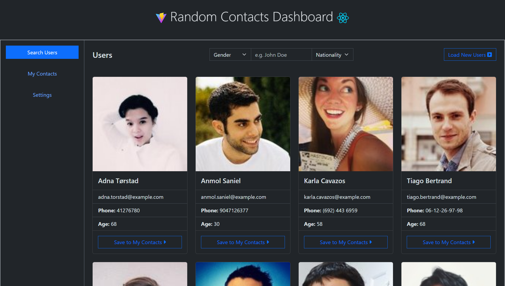
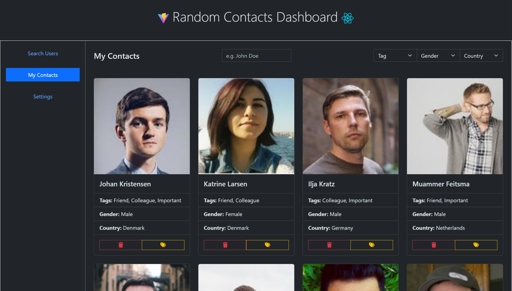
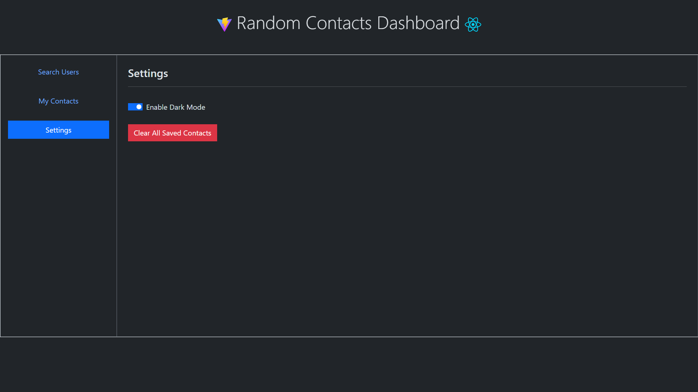

# 💼 Random Contacts Dashboard

A React-based dashboard that lets users search, save, tag, and manage random contacts using the [RandomUser API](https://randomuser.me/). The app also features dark mode, local storage persistence, and filtering capabilities. It is also a **PWA** (Progressive Web App), allowing installation on supported devices.

## 🚀 Features

### 🔍 Search & Fetch

- Search for random users by name or location.
- Filter users by gender or nationality.
- Powered by [randomuser.me API](https://randomuser.me/).

### 💾 Save Contacts Locally

- Save contacts with a single click.
- Contacts are stored in your browser’s localStorage.
- Access saved contacts in the “My Contacts” section.

### 🏷️ Tag & Categorize

- Assign tags like **Friend**, **Colleague**, or **Important**.

### 🔎 Filter & Search Saved Contacts

- Filter contacts by:
  - Tag
  - Gender
  - Country
  - Name (partial match)

### 🗑️ Remove Contacts

- Delete individual contacts.
- Option to clear **all** saved contacts with confirmation dialog.

### 🌙 Dark Mode

- Toggle between Light and Dark themes.
- Theme is saved in localStorage and restored on reload.

### 📲 Installable (PWA Support)

- Works as a Progressive Web App (PWA).
- Can be installed to home screen on mobile or desktop for native-like experience.

## 📂 Folder Structure

```
src/
├── components/         # Reusable components
├── pages/              # Top-level views: Search, MyContacts, Settings
├── hooks/              # Custom React hooks like useLocalStorage
├── utils/              # Helper functions (getFormattedPhone, delUniqueContact, etc.)
├── App.jsx             # Root component with routes/tabs
└── main.jsx            # React entry point
```

## 🛠️ Technologies Used

- React
- Bootstrap 5
- Vite
- LocalStorage API
- Native HTML `<dialog>` and Popover API
- Custom Hooks & Utility Functions

## 📦 Installation

1. **Clone this repo**

   ```bash
   git clone https://github.com/YOUR_USERNAME/YOUR_REPO_NAME.git
   ```

2. **Navigate to project**

   ```bash
   cd YOUR_REPO_NAME
   ```

3. **Install dependencies**

   ```bash
   npm install
   ```

4. **Run locally**

   ```bash
   npm run dev
   ```

5. Open [http://localhost:5173](http://localhost:5173) in your browser.

## 🌐 Deployment (GitHub Pages)

### 1. Update `vite.config.js`:

```js
export default defineConfig({
  base: "/YOUR_REPO_NAME/", // ← required for GitHub Pages
  ...
});
```

### 2. Build & Deploy:

```bash
npm run build
npx gh-pages -d dist
```

Make sure `gh-pages` is installed:

```bash
npm install --save-dev gh-pages
```

Also add this to your `package.json`:

```json
"scripts": {
  "predeploy": "npm run build",
  "deploy": "gh-pages -d dist"
}
```

### 3. Live Link:

Once deployed, your app will be live at:

```
https://YOUR_USERNAME.github.io/YOUR_REPO_NAME/
```

## 📸 Screenshots

| Search Tab                          | My Contacts Tab                         | Settings Tab                            |
| ----------------------------------- | --------------------------------------- | --------------------------------------- |
|  |  |  |

## 🧠 Learning Focus

This project helped practice:

- React fundamentals: `useState`, `useEffect`, `props`, `ref`
- Custom hooks
- LocalStorage usage
- Bootstrap 5 usage in React
- Working with REST APIs
- Conditional rendering and filtering
- Modular project structure

## 🤝 Contributing

Pull requests are welcome. For major changes, open an issue first to discuss what you’d like to change.

---

## © License

[MIT](./LICENSE)
